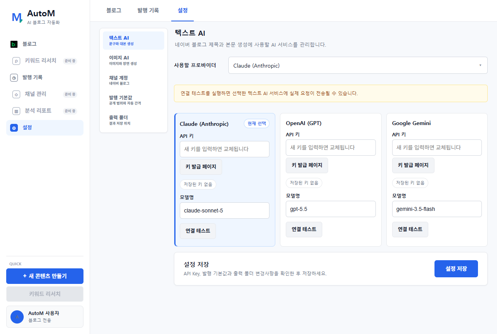
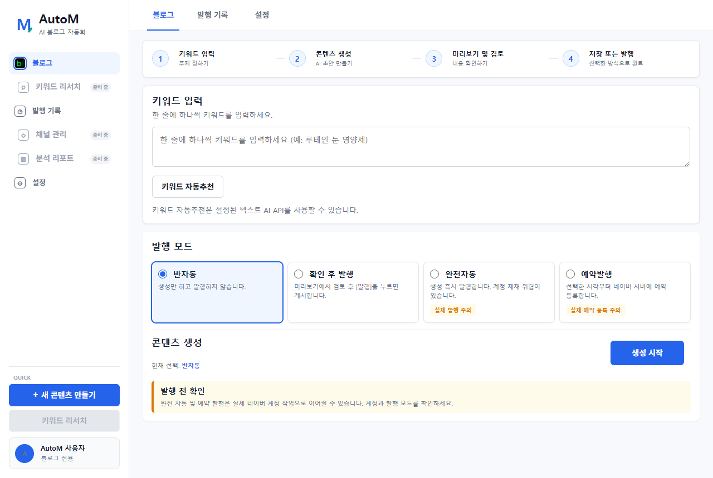
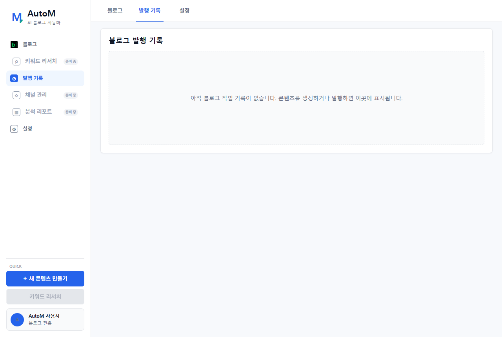

# AutoM 사용자 매뉴얼

> AutoM은 네이버 블로그 콘텐츠 생성과 발행을 도와주는 Windows 프로그램입니다. 키워드를 입력하면 AI가 제목, 본문, 이미지와 태그를 준비하고 사용자가 선택한 방식으로 저장하거나 발행합니다.

## AutoM에서 할 수 있는 일

- 정보형 블로그 키워드 자동추천
- AI 블로그 제목과 본문 생성
- 본문용 AI 이미지 2~4장 생성
- 소제목, 태그와 관련 게시물 내부링크 구성
- 중복 콘텐츠, 과장 표현과 기본 SEO 구조 점검
- 반자동 저장, 확인 후 발행, 완전자동, 예약발행
- 발행 성공·실패·예약 상태와 게시물 URL 확인

> AutoM은 검색 품질을 높이는 구성을 지원하지만 네이버의 검색 노출이나 저품질 판정 방지를 보장하지는 않습니다. 공개 전에는 반드시 사람이 내용과 사실관계를 확인해야 합니다.

## 처음 5분 시작하기

1. 왼쪽 메뉴에서 `설정`을 엽니다.
2. 텍스트 AI와 이미지 AI의 Provider를 선택합니다.
3. API Key와 모델명을 입력하고 `설정 저장`을 누릅니다.
4. 네이버 계정에서 블로그 ID를 입력하고 로그인합니다.
5. 공개 범위, 자동 발행 간격, 이미지 수와 출력 폴더를 확인합니다.
6. `블로그` 메뉴에서 키워드를 입력하고 먼저 `반자동`으로 시험 생성합니다.

---

## 1. 설정 화면

### 이 화면의 역할

AI 서비스, 네이버 계정, 발행 기본값과 결과 저장 폴더를 관리하는 화면입니다. 처음 사용할 때 가장 먼저 설정해야 합니다.

### 텍스트 AI

- 제목, 본문, 태그와 키워드 추천에 사용할 AI를 선택합니다.
- `API 키`에는 해당 AI 서비스에서 발급받은 키를 입력합니다.
- `키 발급 페이지`는 공식 API Key 발급 사이트를 기본 브라우저로 엽니다.
- `연결 테스트`는 실제 AI 요청을 보내므로 비용이 발생할 수 있습니다.
- 연결에 성공한 Provider와 모델은 이후 콘텐츠 생성에 사용됩니다.

### 이미지 AI

- 블로그 본문 이미지를 생성할 AI 서비스를 선택합니다.
- 텍스트 AI와 이미지 AI는 서로 다른 Provider를 선택할 수 있습니다.
- 이미지 생성은 텍스트 생성보다 처리 시간이 길고 비용이 더 발생할 수 있습니다.

### 채널 계정

- 네이버 블로그 ID와 로그인 상태를 관리합니다.
- `네이버 로그인`을 누르면 Chromium 로그인 창이 열립니다.
- 열린 창에서 사용자가 직접 로그인하면 세션이 이 컴퓨터에 저장됩니다.
- `세션 초기화`는 저장된 로그인을 삭제하므로 로그인이 계속 실패하거나 계정을 바꿀 때만 사용합니다.

### 발행 기본값

- 카테고리명: 글을 발행할 네이버 블로그 카테고리입니다.
- 공개 설정: 공개 또는 비공개를 선택합니다.
- 자동·예약 발행 간격: 여러 글 사이의 대기 시간이며 최소 30분입니다.
- 이미지 최대 개수: 글마다 2~4장 사이로 설정합니다.
- 고지문 자동 삽입: 건강·금융·법률처럼 주의가 필요한 글에 분야별 안내문을 추가합니다. 일반 주제에는 붙지 않습니다.

### 출력 폴더

반자동 결과와 생성 파일이 저장될 위치입니다. 기본값은 Windows 문서 폴더 아래의 `마케팅자동화` 폴더입니다.

> API Key는 운영체제 암호화 저장소에 보관되고 화면에는 전체 값이 다시 표시되지 않습니다. 새 컴퓨터에는 자동으로 이전되지 않습니다.

---

## 2. 블로그 화면

### 화면 진행 순서

화면 위쪽의 네 단계가 작업 순서입니다.

1. 키워드 입력
2. 콘텐츠 생성
3. 미리보기 및 검토
4. 저장 또는 발행

### 키워드 입력

- 한 줄에 하나씩 키워드를 입력합니다.
- 여러 키워드를 입력하면 순서대로 작업합니다.
- `키워드 자동추천`은 저장된 텍스트 AI를 사용합니다.
- 이미 발행한 키워드와 중복되면 확인 또는 중단 안내가 표시됩니다.

### 발행 모드

| 모드 | 실제 동작 | 처음 사용자 권장 여부 |
|---|---|---|
| 반자동 | 글과 이미지를 만들고 사용자가 확인한 뒤 폴더에 저장합니다. 실제 발행은 하지 않습니다. | 가장 권장 |
| 확인 후 발행 | 미리보기에서 제목과 본문을 수정한 뒤 `발행`을 눌러야 게시합니다. | 권장 |
| 완전자동 | 생성이 끝나면 네이버에 즉시 발행합니다. | 충분히 시험한 뒤 사용 |
| 예약발행 | 선택한 시각을 네이버의 실제 예약 발행 시각으로 등록합니다. | 예약 시각 확인 필수 |

### 생성 시작을 누르면

1. 키워드와 중복 여부를 확인합니다.
2. 텍스트 AI가 제목, 본문, 소제목, 이미지 위치와 태그를 만듭니다.
3. 이미지 AI가 본문 흐름에 맞는 이미지를 생성합니다.
4. 구조, 이미지 수, 태그 수, 과장 표현과 기존 글 유사도를 점검합니다.
5. 관련성이 충분한 기존 공개 글이 있으면 내부링크 후보로 사용합니다.
6. 선택한 발행 모드에 따라 미리보기, 저장, 발행 또는 예약으로 이동합니다.

### 미리보기에서 확인할 항목

- 제목에 핵심 키워드가 자연스럽게 한 번만 들어갔는지
- 문장이 중간에서 어색하게 끊기지 않는지
- 소제목과 본문 내용이 서로 맞는지
- 이미지가 글의 각 문단과 관련 있는지
- 건강·금융·법률 정보에 단정적인 표현이 없는지
- 내부링크가 현재 글과 실제로 관련 있는지
- 광고성 표현이 지나치지 않은지

> 완전자동과 예약발행은 실제 네이버 계정 작업입니다. 처음에는 같은 주제로 `반자동` 생성부터 확인하는 것이 안전합니다.

---

## 3. 발행 기록 화면

### 확인할 수 있는 정보

- 작업 날짜와 시각
- 입력한 키워드와 생성된 제목
- 반자동·확인 후 발행·완전자동·예약발행 모드
- 성공, 실패 또는 예약 상태
- 예약 시각
- 실제 게시물 URL

`결과 열기`가 표시되면 기본 브라우저에서 게시물을 확인할 수 있습니다.

발행 직후 목록에 보이지 않으면 `발행 기록` 메뉴를 다시 열어 최신 기록을 불러옵니다.

> 발행 기록은 설치 폴더가 아니라 Windows 사용자 데이터 폴더에 저장됩니다. 프로그램을 삭제하고 다시 설치해도 같은 컴퓨터와 Windows 사용자라면 기록이 남아 있을 수 있습니다.

---

## 실제 발행 전 체크리스트

- [ ] 올바른 네이버 계정으로 로그인되어 있다.
- [ ] 공개·비공개 설정을 확인했다.
- [ ] 예약 날짜와 시각을 확인했다.
- [ ] 제목, 본문과 이미지 내용을 사람이 검토했다.
- [ ] 과장된 효능, 사실과 다른 표현과 오타를 수정했다.
- [ ] 내부링크가 관련 게시물로 연결되는지 확인했다.
- [ ] 자동 발행 간격을 너무 짧게 설정하지 않았다.

## 자주 발생하는 문제

### 텍스트 API를 입력하라는 메시지가 나옵니다

설정에서 선택한 텍스트 AI Provider와 입력한 API Key가 같은 서비스인지 확인하고 `설정 저장`을 누릅니다.

### 이미지 생성이 오래 걸립니다

이미지는 카드 수와 이미지 수만큼 외부 AI 요청이 필요합니다. 네트워크와 Provider 상태에 따라 수 분이 걸릴 수 있습니다.

### 네이버 로그인이 풀렸습니다

먼저 `네이버 로그인`으로 다시 로그인합니다. 계속 실패할 때만 세션을 초기화합니다.

### 발행에 실패했습니다

오류 문구와 발행 기록을 확인합니다. 네이버 글쓰기 화면이 변경된 경우 자동화가 일시적으로 실패할 수 있으므로 실패 화면과 로그를 개발자에게 전달합니다.
