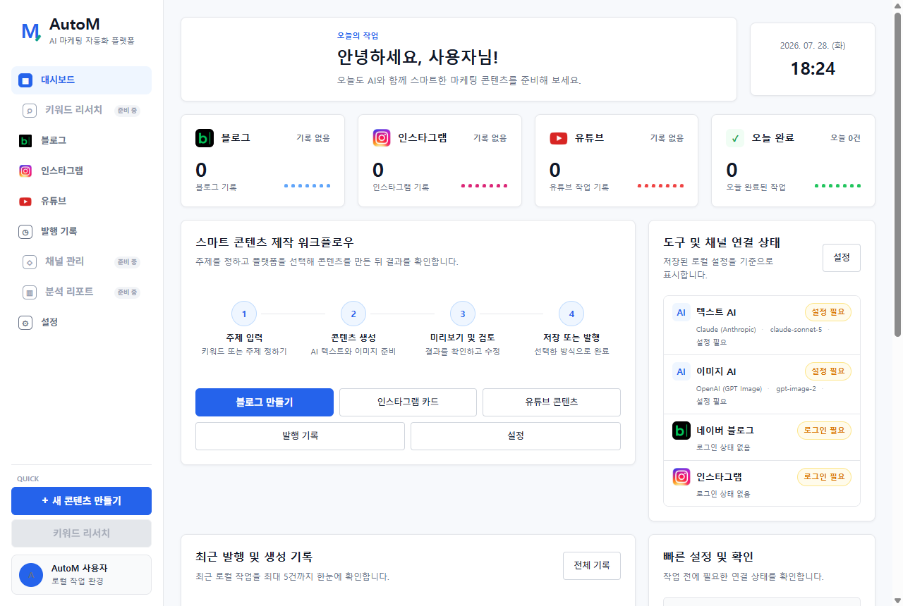
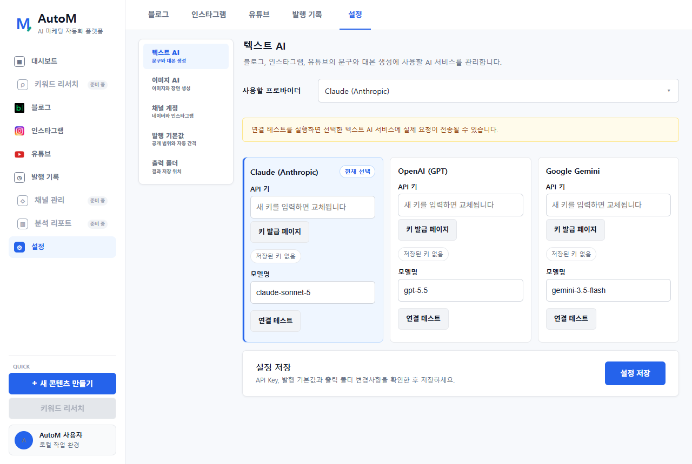
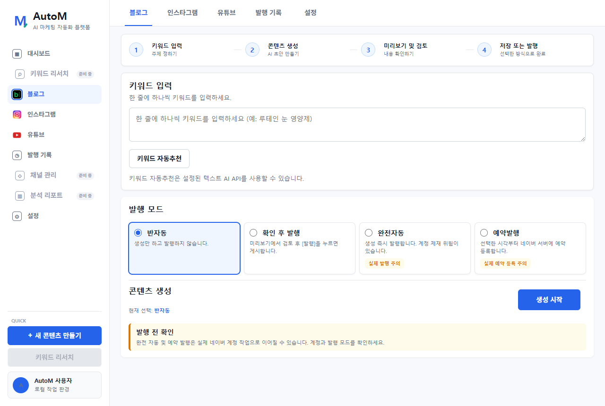
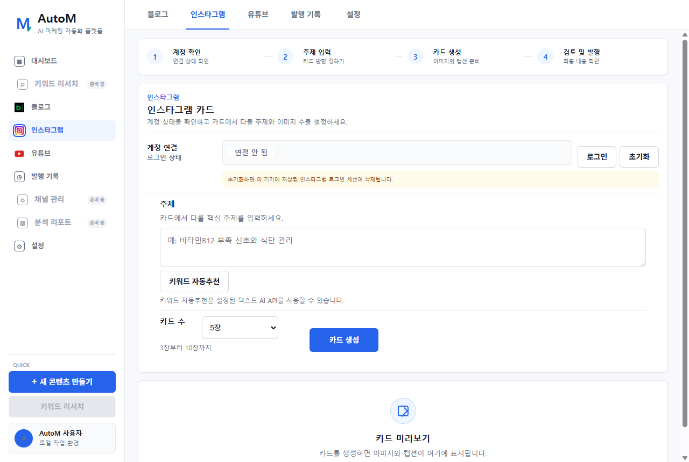
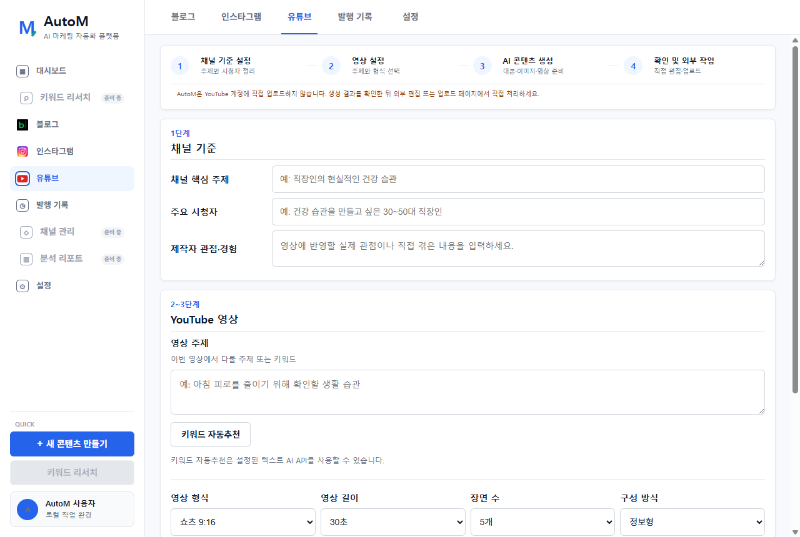
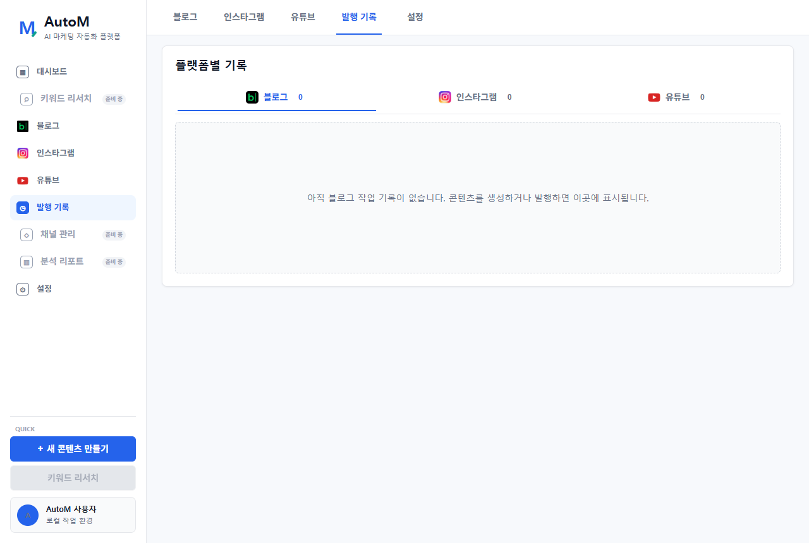

# AutoM Creator 사용자 매뉴얼

> AutoM Creator는 네이버 블로그, 인스타그램 카드뉴스와 YouTube 영상 초안을 한 프로그램에서 만드는 Windows 콘텐츠 제작 도구입니다.

## 프로그램에서 할 수 있는 일

- 플랫폼별 AI 콘텐츠 생성
- 블로그 글·이미지 생성과 네이버 발행
- 인스타그램 카드 이미지·캡션 생성과 발행
- YouTube 쇼츠·롱폼 영상 초안, 대본과 자막 생성
- 플랫폼별 생성·발행 기록 확인
- AI Provider, API Key와 플랫폼 로그인 관리

## 처음 5분 시작하기

1. `설정`에서 텍스트 AI와 이미지 AI를 연결합니다.
2. 네이버와 인스타그램 로그인 상태를 확인합니다.
3. 출력 폴더와 발행 기본값을 저장합니다.
4. `대시보드`에서 설정 필요 항목이 있는지 확인합니다.
5. 처음에는 실제 발행이 없는 블로그 반자동 또는 YouTube 초안 생성으로 시험합니다.

---

## 1. 대시보드

### 이 화면의 역할

현재 설정과 최근 작업 상태를 한눈에 확인하는 첫 화면입니다. 화면에 표시되는 수치는 실제 로컬 발행 기록과 저장된 설정을 사용합니다.

### 주요 영역

- 블로그·인스타그램·YouTube 카드: 플랫폼별 작업 건수와 최근 상태
- 오늘 완료: 오늘 완료된 전체 작업 건수
- 스마트 콘텐츠 제작 워크플로우: 입력부터 저장 또는 발행까지의 기본 순서
- 도구 및 채널 연결 상태: AI Key와 플랫폼 로그인 준비 여부
- 최근 발행 및 생성 기록: 최근 작업 최대 5건
- 빠른 설정 및 확인: 작업 전에 해결해야 할 항목

`설정 필요` 또는 `로그인 필요`가 보이면 콘텐츠를 만들기 전에 해당 설정 화면을 먼저 확인합니다.

> 대시보드는 저장된 로컬 정보를 요약합니다. 외부 플랫폼의 실시간 조회수나 수익 통계를 제공하는 분석 화면은 아닙니다.

---

## 2. 설정

### 설정 메뉴 구성

- 텍스트 AI: 블로그 글, 카드 문구, 캡션과 YouTube 대본 생성
- 이미지 AI: 블로그 이미지, 인스타그램 카드 배경과 YouTube 장면 생성
- 채널 계정: 네이버와 인스타그램 로그인 상태 관리
- 발행 기본값: 공개 범위, 자동 간격, 이미지 수와 고지문
- 출력 폴더: 생성 결과 저장 위치

### 처음 설정하는 순서

1. 텍스트 AI Provider를 선택합니다.
2. API Key와 모델명을 입력합니다.
3. 이미지 AI도 같은 방식으로 설정합니다.
4. 필요할 때만 `연결 테스트`를 실행합니다.
5. 네이버와 인스타그램에 로그인합니다.
6. 발행 기본값과 출력 폴더를 확인합니다.
7. 마지막으로 `설정 저장`을 누릅니다.

> 연결 테스트, 키워드 추천과 콘텐츠 생성은 실제 외부 AI 요청이며 비용이 발생할 수 있습니다. API Key는 화면 이미지나 고객지원 메시지에 첨부하지 마세요.

---

## 3. 블로그

블로그 기능은 AutoM 블로그 전용 프로그램과 같은 방식으로 동작합니다.

### 사용 순서

1. 키워드를 한 줄에 하나씩 입력합니다.
2. 필요하면 `키워드 자동추천`을 사용합니다.
3. 반자동, 확인 후 발행, 완전자동 또는 예약발행을 선택합니다.
4. `생성 시작`을 누릅니다.
5. 미리보기에서 제목, 본문, 이미지와 품질 점검 결과를 확인합니다.
6. 선택한 모드에 따라 저장하거나 발행합니다.

### 처음 사용자에게 권장하는 모드

`반자동`은 실제 발행 없이 결과물을 폴더에 저장할 수 있어 첫 시험에 가장 적합합니다. `확인 후 발행`은 내용을 검토하고 명시적으로 발행 버튼을 눌러야 합니다.

`완전자동`과 `예약발행`은 실제 네이버 계정에 게시하거나 예약하므로 경고창과 예약 시각을 반드시 확인합니다.

---

## 4. 인스타그램

### 사용 순서

1. 화면 위쪽에서 로그인 상태를 확인합니다.
2. 연결되어 있지 않다면 `로그인`을 누릅니다.
3. 열린 Chromium 창에서 사용자가 직접 인스타그램에 로그인합니다.
4. 카드에서 다룰 주제를 입력하거나 `키워드 자동추천`을 사용합니다.
5. 카드 수를 선택합니다.
6. `카드 생성`을 누릅니다.
7. 카드 이미지, 이미지 속 문구, 순서, 캡션과 해시태그를 검토합니다.
8. 준비가 끝났을 때만 `실제 발행`을 누릅니다.

### 생성되는 결과

- 선택한 수만큼의 세로형 카드 이미지
- 카드별 제목과 설명 문구
- 게시물 캡션
- 중복을 정리한 해시태그
- 로컬 출력 폴더의 이미지와 텍스트 파일

### 확인할 항목

- 배경과 글자 색상의 대비가 충분한지
- 단어가 중간에서 잘리지 않았는지
- 긴 고유명사와 숫자가 화면 밖으로 나가지 않았는지
- 카드 순서가 자연스러운지
- 광고·치료 효과를 단정하는 표현이 없는지

> `초기화`는 이 컴퓨터에 저장된 인스타그램 로그인 세션을 삭제합니다. 계정을 바꾸거나 로그인이 계속 실패할 때만 사용합니다.

---

## 5. YouTube

### 기능 범위

YouTube 화면은 영상 제작에 필요한 초안 파일을 만듭니다. AutoM Creator가 YouTube 계정에 직접 업로드하지는 않습니다.

### 사용 순서

1. 채널 핵심 주제를 입력합니다.
2. 주요 시청자를 입력합니다.
3. 제작자의 실제 경험, 관점과 설명 방식을 작성합니다.
4. 영상 주제를 입력하거나 자동추천을 사용합니다.
5. 쇼츠 9:16 또는 롱폼 16:9를 선택합니다.
6. 영상 길이, 장면 수와 구성 방식을 선택합니다.
7. `영상과 대본 생성`을 누릅니다.
8. 생성된 대본, 장면 이미지, 영상 파일과 업로드 문구를 검토합니다.
9. `CapCut 편집 페이지 열기`에서 편집과 직접 녹음을 진행합니다.
10. `YouTube 업로드 페이지 열기`에서 사용자가 직접 업로드합니다.

### 생성되는 결과

- WebM 영상 초안
- 전체 녹음 대본
- 장면별 내레이션과 이미지
- SRT 자막
- 썸네일 이미지
- 제목, 설명과 태그 초안
- 채널 소개 문구 초안

> 수익화 승인과 정책 준수를 보장하는 기능은 아닙니다. 반복적인 대량 영상이 되지 않도록 제작자의 실제 경험, 직접 녹음, 설명과 편집을 추가해야 합니다.

---

## 6. 발행 기록

### 플랫폼별 탭

- 블로그: 저장, 실제 발행과 예약 결과
- 인스타그램: 카드 생성 및 실제 발행 결과
- YouTube: 영상 프로젝트 생성 결과

### 기록에서 확인할 정보

- 작업 날짜
- 키워드 또는 주제
- 생성된 제목
- 작업 모드
- 성공·실패·예약 상태
- 예약 시각
- 결과 URL

실패 기록은 같은 작업을 반복하기 전에 오류 원인과 출력 폴더를 확인하는 용도로 사용합니다.

> 발행 기록은 Windows 사용자 데이터 폴더에 저장됩니다. 같은 컴퓨터와 Windows 사용자에서는 프로그램을 재설치해도 기존 기록이 다시 표시될 수 있습니다.

---

## 실제 작업 전 공통 체크리스트

- [ ] 사용할 텍스트 AI와 이미지 AI가 `설정됨` 상태다.
- [ ] 올바른 네이버 또는 인스타그램 계정으로 로그인되어 있다.
- [ ] 출력 폴더에 충분한 저장 공간이 있다.
- [ ] 외부 AI 사용 비용과 사용 한도를 확인했다.
- [ ] 생성 결과를 사람이 검토했다.
- [ ] 실제 발행 버튼인지, 단순 생성 버튼인지 확인했다.
- [ ] YouTube 결과에는 직접 녹음과 편집을 추가했다.

## 준비 중인 메뉴

`키워드 리서치`, `채널 관리`, `분석 리포트`는 현재 준비 중입니다. 화면에 표시되더라도 버튼이 비활성화되어 있으며 실제 기능이나 통계를 제공하지 않습니다.

## 오류 해결

### API Key 오류

선택한 Provider와 입력한 API Key의 서비스가 같은지 확인합니다. 새 키를 입력한 뒤 설정을 저장하고 필요한 경우 연결 테스트를 실행합니다.

### Chromium 실행 파일 오류

최신 설치 파일을 다시 설치합니다. 정상 설치본에는 자동 로그인과 발행에 필요한 Chromium이 포함되어 있습니다.

### 인스타그램 만들기 버튼을 찾지 못합니다

인스타그램 화면 구조가 변경됐거나 로그인 창의 상태가 다를 수 있습니다. 로그인 상태를 확인하고 실패 화면과 로그를 개발자에게 전달합니다.

### 영상 생성이 오래 걸립니다

장면 수만큼 이미지 생성과 영상 합성이 필요합니다. 선택한 길이와 장면 수가 많을수록 시간이 오래 걸립니다.

### 발행 또는 생성 기록이 바로 보이지 않습니다

`발행 기록` 탭을 다른 탭으로 이동했다가 다시 열어 최신 기록을 불러옵니다.

